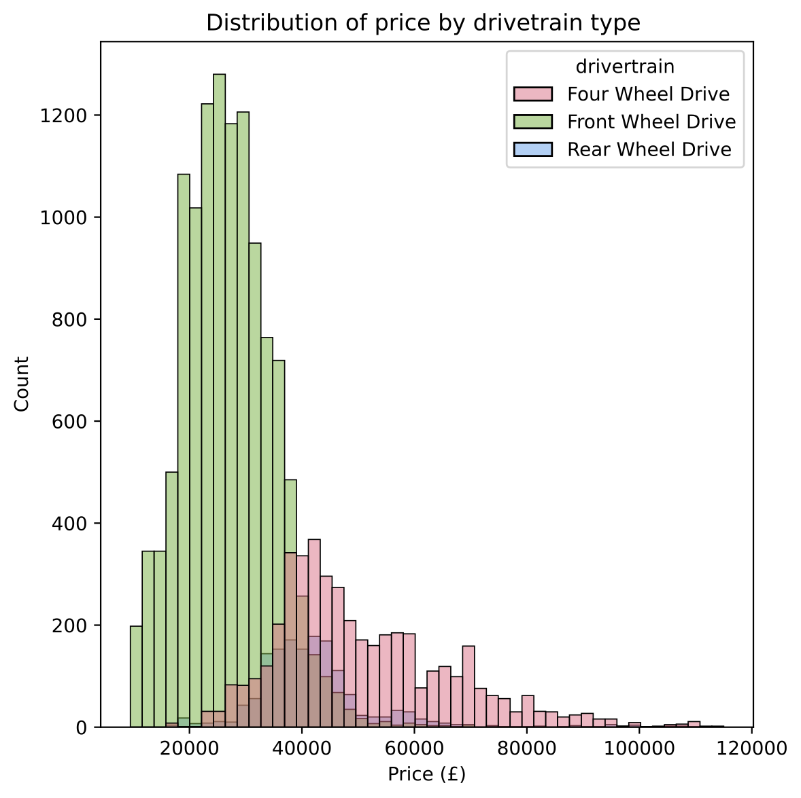

# Understanding Value in the UK Used Car Market in 2022

# Context

This project was completed as part of the General Assembly Data Science Immersive bootcamp. This document discusses the problem, hypothesis, methodology, conclusion, and tools used.

# Table of Contents

- [Background and Problem Statement](#background-and-problem-statement)<br> 
- [Objectives](#objectives)<br>
- [Data Acquisition](#data-acquisition)<br>
- [Data Cleaning and Feature Engineering](#data-cleaning-and-feature-engineering)<br>
- [Exploratory Data Analysis (EDA)](#exploratory-data-analysis-eda)<br>
- [Modelling](#modelling)<br>
    - [Selecting a Model](#selecting-a-model)<br>
    - [The Final Model](#the-final-model)<br>
- [Model Interpretation](#model-interpretation)<br>
    - [Feature Importance](#feature-importance)<br>
    - [Permutation Importance with ELI5 and Used Car Value Breakdown](#permutation-importance-with-eli5-and-used-car-value-breakdown)<br>
- [Validating the Hypothesis](#validating-the-hypothesis)<br>
- [Limitations](#limitations)<br>
- [Conclusions](#conclusions)<br>
- [Identifying Further Work](#identifying-further-work)<br>
- [Further Work Attempted - Additional Predictors](#further-work-attempted---additional-predictors)<br>
    - [Car Boot Volume Data](#car-boot-volume-data)<br>
    - [Dealer Location Data](#dealer-location-data)<br>
    - [Modelling Impact](#modelling-impact)<br>
- [Key Learnings and Challenges](#key-learnings-and-challenges)<br>
- [Contact](#contact)<br>

# Background and Problem Statement

The second-hand car market in the UK is currently thriving due to the shortage of new models and cars under three years of age. According to [some figures](https://www.bbc.com/news/business-58150025) the used car market has grown astronomically since the pandemic began, with more than 2.2 million used cars exchanged since 2019.  

A global shortage of computer chips used in car production, as well as other materials such as copper, aluminium and cobalt, has led to fewer new vehicles rolling off production lines. That has meant more buyers turning to the used-car market. Of course the car industry has not been the only industry to suffer from the global chip shortage, but despite popular demand, the car industry has struggled to deliver brand new cars to buyers. Computer chips are used in everything from modern infotainment systems, windscreen wipers and electric car batteries to name a few.

It’s estimated the chip crisis will cause 100,000 vehicles to not be delivered before the end of 2021, representing a huge blow for the industry. 

<b>Given that the chip shortage is unlikely to be resolved in the immediate future, now more than ever it would be helpful to be able to identify good value in the UK used car market. That is what this project intends to do.</b>

# Objectives

My primary objective for this project is to:

* Generate a predictive model for used car price in the UK in 2022.

* The final model must be interpretable.

My secondary objective is to test the hypothesis that:

* When all other car attributes are equal, A Dacia branded car is cheaper than a Volvo branded car.

# Data Acquisition

The data for this project came from [autotrader.co.uk](https://www.autotrader.co.uk/). Although AutoTrader do have an API, access is only permitted with a commercial contract. As such, the project data had to be obtained through use of a web scraper. Figure 1 below describes a typical search result on autotrader.co.uk

<br>
<p align="center" width="100%">
<kbd></kbd>
</p>
<p align="center"><i><sub><b>Figure 1:</b> Sample autotrader.co.uk search result page with scraped fields highlighted in green.</sub></i></p>
<br>

Evidently, each car listing is rich in information. At this early stage in the project a 'more is more' approach was adopted. It was intended to gather all information in as few web scrapes as possible, without duplicating work by going back to revisit a car listing at a later date. Of particular interest was the free-form text box between car year and car price - often where car listings were lacking in specific details such as BHP, engine size or number of doors, they could be found and recovered from this string using RegEx. 

Over 400,000 new and used cars were successfully scraped from AutoTrader. 

Two problems overcome during web scraping:

* Problem 1 involved a hard limit on the search results. Search results were limited to 1000 car listings per search. This is not a problem if the search criteria are highly specific as the platform would expect, although for this project it was important to return all car listings. To navigate this problem, thousands of complimentary searches were performed and the number of returned results were verified to be less than 1000 before continuing to scrape the data.

* The solution to problem 1 likely contributed to problem 2; the searching behaviour was being flagged as problematic by the website. AutoTrader employ Cloudflare website security to prevent algorithms like this overloading their server with requests. The security successfully prevented the Python Requests package from gaining access to search results, however switching to Cloudscraper instead resolved all issues. 

After a small number of iterative improvements to the web scraping function, the dataset was scraped in four days in the week commencing 31/01/2022. This is the date at which data are accurate.

<br>
<p align="center" width="100%">
<kbd></kbd>
</p>
<p align="center"><i><sub><b>Figure 2:</b> Non-exhaustive list of the data points scraped for each car listing. Not all data points persisted into the final model, but that wasn't to be known at this stage.</sub></i></p>
<br>

Data acquisition from autotrader.co.uk has been documented in greater detail in notebook [00_AutoTrader_scrape.](https://github.com/rgdavies92/used-car-value/blob/main/01_AutoTrader_scrape.ipynb)

# Data Cleaning and Feature Engineering

The AutoTrader dataset has been gathered from car listings which are posted by thousands of dealers across the UK. As such, the car listings can be a little variable in terms of content and quality. Full details on the data cleaning performed in this project are available in the [04_Data_Cleaning_and_EDA](https://github.com/rgdavies92/used-car-value/blob/main/04_Data_cleaning_and_EDA.ipynb) notebook, with some of the more interesting parts summarised below:
* BHP data were standardised in terms of units. Some more recent cars were reported in units of PS - the German equivalent.

* Dealer location and rating data were extracted from the associated dealer href.

* Engine size was populated using RegEx - see figure 3 below. This was particularly problematic for electric vehicles as they don't have cylinders. in the engine and measure size in units of kilowatts instead of litres. An additional e_engine column was added to differentiate.

* Number of doors was populated and standardised using RegEx. Interestingly pickup trucks describe doors in a different way to all other cars.

* Added a used/new flag to allow for simple filtering.

* Utilised GeoPy with the Google Maps API to obtain dealer county information. This involved moving from dealer location, which was often a city or an area, to dealer latitude and longitude before reverting back to dealer county.

```python3
# Iterate over missing engine rows and use RegEx on name_subtitle to extract engine 
# size where possible. Note that electric engines are handled differently.

for index, car in ucars[ucars['engine'].isnull()].iterrows():
    car_subname = ucars.loc[index, 'name_subtitle']
    try:
        enginesize = re.findall('([0-9][.][0-9]+)',car_subname)[0]
    except: 
        enginesize = np.nan
    ucars.loc[index,'engine'] = float(enginesize)
```
</p>
<p align="center"><i><sub><b>Figure 3:</b> Sample data cleaning codeblock using RegEx to extract missing engine size data.</sub></i></p>
<br>

With all data cleaning and feature engineering finished, there were 
247 new and used cars in the dataset. 378,597 of these were used cars, which this project focuses on. A [data dictionary file](data_dictionary.md) has been prepared to provide further detail. 

# Exploratory Data Analysis (EDA)

Although this is a used car project, data have been scraped and cleaned for both new and used cars. It was at this point, at the beginning of the EDA, that new cars were dropped to focus on used cars only. 

There were no immediate surprises in the EDA. The dataset was scrutinised from a number of different angles to check for patterns and trends. Some of the more descriptive relationships within the dataset are captured in figures 4-7 below, with a more comprehensive EDA to be found in the [04_Data_Cleaning_and_EDA](https://github.com/rgdavies92/used-car-value/blob/main/04_Data_cleaning_and_EDA.ipynb) notebook.

<br>
<p align="center" width="100%">
<kbd></kbd>
</p>
<p align="center"><i><sub><b>Figure 4:</b> Plot describes the quantity of used cars for sale in the UK for the 30 most common brands.</sub></i></p>
<br>

Evidently a BMW is the most common used car for sale in the UK right now, making up just under 10% of all used cars on AutoTrader. German brands do well in general, with four of the top five most common brands from Germany. 

<br>
<p align="center" width="100%">
<kbd></kbd>
</p>
<p align="center"><i><sub><b>Figure 5:</b> Plot describes price distribution by car brand for each of the 16 most common car brands.</sub></i></p>
<br>

Figure 5 tells many stories about the price distribution of the different car brands displayed. Land Rover, Mercedes-Benz and Volvo stand out as some of the most expensive used cars brands, with Vauxhall and Renault the least expensive. beyond this the skew of each brand distribution tells of how varied their car offering is. The high skew brands such as Land Rover, Audi, BMW and Mercedes-Benz have a greater number of cars for sale beyond the 95th percentile and it can be deduced that these brands cater to the high-end car market as well as to their prime market between the 1st and 3rd interquartile ranges. The same cannot be said for brands like Mini, where the skew is much reduced.

<br>
<p align="center" width="100%">
<kbd></kbd>
</p>
<p align="center"><i><sub><b>Figure 6:</b> Plot describes the average used car price by year produced. Black confidence bounds at the top of each bar can be seen to grow wider as cars grow older due to a reduced number of cars for sale from each year. The same effect can be seen for used cars from 2022.</sub></i></p>
<br>

The average used car value plot by year produced points out an interesting non-linear relationship between used car price and age. Average used car price seems to fall from 2022 produced cars to 2003 produced cars at which point it begins to rise slightly. This may be due to the influence of some sort of unexplained vintage-factor. The fact that this relationship is not perfectly linear may have implications for linear models, to be broached in the modelling section. 

<br>
<p align="center" width="100%">
<kbd></kbd>&nbsp; &nbsp; &nbsp; &nbsp;<kbd></kbd>
</p>
<p align="center"><i><sub><b>Figure 7:</b> Plot describes price distribution by car transmission on the left and by car drivetrain on the right.</sub></i></p>
<br>

Figure 7 is the final plot in this EDA section and images the used car price distribution when divided by two of the categorical variables; drivetrain and transmission. Early indications show that categorical variables such as these should be valuable in determining used car value. Manual transmission cars are generally cheaper than automatic transmission cars and four-wheel-drive cars are generally more expensive than front-wheel-drive cars. Interestingly, rear-wheel-drive cars seem to be more expensive than front-wheel-drive cars. This may be because rear-wheel-drive cars in the UK are predominantly BMW or Mercedes-Benz, which have been identified as more expensive in figure 5. 

# Modelling

For car listing features which were used in the following modelling process, refer to blue font in figure 2.

## Selecting a Model

A range of nine regression modelling methods were evaluated on a random subset of 50,000 in order to provide a quick evaluation of model suitability. The data were train-test split in an 80:20 ratio to enable evaluation on unseen data and five fold cross-validation was employed on the training dataset to reduce overfitting. Parameters for each model were optimised via method specific grid searching. An overview of the tested models can be found on slide 6 of the [non-technical presentation](https://github.com/rgdavies92/used-car-value/blob/main/Used_car_value_non_technical_presentation.pdf) or specific details can be found in section 3 of notebook [05_Modelling_version1](https://github.com/rgdavies92/used-car-value/blob/main/05_Modelling_version1.ipynb). For this summary, the range of R<sup>2</sup> scores and corresponding price residual distributions are presented for each of the tested models in figure 8 below. 

<br>
<p align="center" width="100%">
<kbd></kbd>
</p>
<p align="center"><i><sub><b>Figure 8:</b> Summary plot of tested models. Models are sorted in ascending order by R<sup>2</sup> score on an unseen testing dataset. Machine learning methods tested came from the Scikit-Learn and XGBoost packages. </sub></i></p>
<br>

The top four models in figure 8 are based around linear regression and yield the least impressive scores. This is likely due to some violations of the linear regression assumptions. The final five models are based on decision trees, with the final four models employing either bagging or boosting to enhance predictions. Improvements in R<sup>2</sup> score from top to bottom are reflected in the shape of residual distribution for each method - a high R<sup>2</sup> score yields a taller, narrower, residual distribution.

Although the XGBoostRegressor() marginally outperformed the GradientBoostingRegressor() on the test dataset, the GradientBoostingRegressor() model was evidenced to contain less variance.

## The Final Model

A Gradient Boosting Regressor model from the Scikit-learn package was selected as the optimal model to proceed with on the full dataset; this is one of the decision tree based methods. As before, the data were train-test split in an 80:20 ratio to enable evaluation on unseen data and five fold cross-validation was employed on the training dataset to reduce overfitting. Increasing the number of cars from 50,000 to 378,597 served to both increase model run-times and further reduce model variance.

<br>
<p align="center" width="100%">
<kbd></kbd>
</p>
<p align="center"><i><sub><b>Figure 9:</b> Optimal model scoring metrics evaluated on the test and train datasets. </sub></i></p>
<br>

The final model can be seen to explain 95% of the variance in used car price within the dataset that is not explained by the baseline (average) model. RMSE for the final model is approximately £2500 - note that this model scoring metric is weighted towards the larger errors. 

<br>
<p align="center" width="100%">
<kbd></kbd>
</p>
<p align="center"><i><sub><b>Figure 10:</b> True listing price vs predicted used car price.</sub></i></p>
<br>

# Model Interpretation

On the trade-off cross-plot of accuracy against interpretability, Gradient Boosting methods are generally deemed to be more accurate than interpretable. 

## Feature Importance

Scikit-learn can quickly produce the feature importance, or gini importance associated with the model. This is defined to be the normalised total-reduction of the criterion by each feature, or more simply this could be interpreted as 'how helpful each of the predictors were in defining tree branches within the model'. 

<br>
<p align="center" width="100%">
<kbd></kbd>
</p>
<p align="center"><i><sub><b>Figure 11:</b> Feature importances or Gini importances attributed to the top 10 most influential predictors within the Gradient Boosting model. </sub></i></p>
<br>

A downside to the feature importance measured above in figure 11 is that it does not capture the nature of the relationship between each of the predictors and the target, i.e. whether it is a positive or negative predictor. For example, based on the distribution in figure 7 it is observed that a front-wheel-drive used car is generally cheaper or below average price, however the feature importance only informs that it is the 8th most important feature in determining used car price. This form of feature importance does not satisfy the initial objective that any produced model must be interpretable to identify value.

## Permutation Importance with ELI5 and Used Car Value Breakdown

To combat the identified shortcomings of feature importance the Explain it Like I'm 5 (ELI5) package has been utilised to calculate permutation importance. ELI5 will shuffle (i.e. remove the information) one predictor at a time from the predictor set and measure how model scoring suffers. The associated weight is then ascribed to each of the predictors. After the permutation importance has been obtained, ELI5 can be further used to provide granular detail on how each predictor variable impacts the model prediction for a given used car, and importantly whether the nature of that relationship is positive or negative. Figure 12 below steps through the way in which ELI5 has been used to generate a used car value breakdown. 

<br>
<p align="center" width="100%">
<kbd></kbd>
</p>
<p align="center"><i><sub><b>Figure 12:</b> Engineered used car value breakdown using permutation importance from the ELI5 package.</sub></i></p>
<br>

The green and red box at the top is a raw output from ELI5's <i>show_weights</i> function, with positive predictors in green and negative predictors in red. Notice how despite this car being Ford, the fact that this car is also not a Land Rover has an impact on the predicted price. It is relationships like this which have been collapsed into a single accumulated price impact in the central table. As this feature is particularly useful, there are more examples of used car value breakdowns to be found in the linked [non-technical presentation](https://github.com/rgdavies92/used-car-value/blob/main/Used_car_value_non_technical_presentation.pdf) and the notebook [05_Modelling_version1.](https://github.com/rgdavies92/used-car-value/blob/main/05_Modelling_version1.ipynb)

With the ELI5 analysis of the final model in place, the inner workings of the model have become suitably explainable and transparent. The [primary objective](#objectives) has been satisfied.

# Validating the Hypothesis

With the model finalised it was then possible to test the hypothesis; <i>is a Dacia cheaper than a Volvo?</i>

To verify this hypothesis, a series of synthetics used cars were generated with identical attributes other than the car brand. These cars were then pushed into the model for price prediction and the outputs plotted below in figure 13. 

<br>
<p align="center" width="100%">
<kbd></kbd>
</p>
<p align="center"><i><sub><b>Figure 13:</b> Synthetic car value plot where all attributes are constant but car brand. YEar was fixed at 2018, mileage was fixed at 30000 and BHP was fixed at 100. Volvo and Dacia brands associated with the hypothesis have been coloured red.</sub></i></p>
<br>

Figure 13 illustrates that Tesla is the most expensive car brand modelled and Ssangyong is the least expensive car brand modelled. It also confirms the hypothesis that a Dacia branded car is indeed cheaper than a Volvo branded car. A Dacia is the third cheapest brand of the used cars modelled in this project. The hypothesis has been validated as true and the [secondary project objective](#objectives) has been satisfied. 

The full modelling workflow from model selection on a subset of the data to model interpretation with ELI5 is documented in notebook [05_Modelling_version1.](https://github.com/rgdavies92/used-car-value/blob/main/05_Modelling_version1.ipynb)

# Limitations

Having satisfied both project objectives, there are a number of limitations to be aware of:

* This project relies on the assumption that the listed cars are sold at the advertised price at the time of web scraping. It is common practice to reduce the price of a car if it has not been able to sell, but that would be missed by the dataset. To navigate this problem data would need to be obtained with <i>sold price</i> rather than the <i>advertised price</i> which this project is based on. This would likely require access to the commercial AutoTrader API.

* The gathered data may go stale quickly. The [background](#background-and-problem-statement) to this project noted how different pressures are acting on the UK used car market in early 2022. If these conditions were to change and the market changed too then the base data for this project would become less appropriate. If this model is to be used to inform used car buying decisions then it is recommended to gather fresh data.

* Numerous data entry errors have been identified throughout data cleaning, but only ones which could be identified as statistical anomalies. Non-remarkable data entry errors would harm the model but are difficult to identify. The gathered data is only as accurate as the used car dealers creating the car listings. 

* Finally, 'car specification' is not captured well in the dataset. Each new car on sale comes with numerous optional extras in terms of 'trim' or performance which are certainly applicable to used cars too but not well captured by this model. In fact, the largest outliers in the final price residual distribution have been attributed to unusual or rare specifications. Figure 14 below shows the car listing for the largest outlier.

<br>
<p align="center" width="100%">
<kbd></kbd>
</p>
<p align="center"><i><sub><b>Figure 14:</b> The car listing which yielded the greatest discrepancy between true price and predicted price is imaged above. As described in the limitations, the model does not handle vehicles with non-standard features well, and this Mercedes-Benz mobile office is highly irregular! </sub></i></p>
<br>

# Conclusions

In short, all project objectives have been met.

* A predictive model has been generated which can predict used car price with an R<sup>2</sup> score of 0.954. This model is built using a gradient boosting regressor from Scikit-learn and the ELI5 package has been used to illuminate how it operates 'under the hood' to better understand what generates value in the used car market.

* Synthetic cars have been used to investigate the price influence of each car brand. The Dacia brand is confirmed to be cheaper than the Volvo brand. 

One further implementation of the work within this project is that it could be used to predict the price depreciation of a car. This prediction over time would be subject to the same market conditions as discussed in the project limitations and may need to account for economic inflation but conceptually it is possible. Figure 15 below illustrates an ambitious twenty year price prediction for my 2008 Volkswagen Polo, assuming a constant 7000 miles per year. Economic conditions have not been compensated for in this prediction. 

<br>
<p align="center" width="100%">
<kbd></kbd>
</p>
<p align="center"><i><sub><b>Figure 15:</b> Future price prediction of 2008 Volkswagen Polo assuming 7000 miles each year. This plot assumes that economic conditions are constant over time. </sub></i></p>
<br>

# Identifying Further Work

A number of interesting avenues have been identified for possible future work:

* Experiment with other modelling algorithms
  * A deep learning modelling method may be able to improve the accuracy of price prediction.

* Try to improve the gradient boosting model through the introduction of additional predictors:
  * Would additional information on car boot size improve the model?
  * Would additional information about dealer location improve the model?

* It would be interesting to benchmark the used car price prediction from this model against AutoTrader's own valuge gauge. 
  * This gauge is not available on every listing and would require a new web scrape.
  * It would pose an interesting classification problem although as with the regression problem, it would benefit from having sold price data available rather than listed price. 

* Finally, since the project has some useful applications for people close to the used car market, it would be helpful to package the model and predictive/analytic functions in a neat way which allows a reader to interact. 


In order to progress the project further, some of the further work ideas have been addressed.

# Further Work Attempted - Additional Predictors

## Car Boot Volume Data

[Carsized.com](https://www.carsized.com/en/) has been scraped for car dimensions for over 1000 different models of cars to help investigate whether car boot size influences the price of a used car. 

<br>
<p align="center" width="100%">
<kbd></kbd>
</p>
<p align="center"><i><sub><b>Figure 16:</b> Carsized.com was selected as the source of additional predictor information for the model. </sub></i></p>
<br>

Although it can be explained quickly, gathering, cleaning and merging predictor variables from an additional data source was a time consuming process. The steps taken were:
* Scrape dimensions and volumetric details for all cars on Carsized.com
* Build and condition three variables on which to merge the Carsized data with AutoTrader data; year, body and car name. This involved some RegEx and translation from American English to UK English.
* Use <i>ffill</i> and <i>bfill</i> to populate Carsized data for all years covered by the AutoTrader data. For example, the Volkswagen Polo dimensions from the 2005 model were replicated with <i>ffill</i> for all years up to 2014, when a newer model was released.

The additional car boot size data were merged with the existing AutoTrader data with non-matched cars dropped. This left 319,663 complete used cars entries for this additional modelling. 

Scraping carsized.com is documented in notebook [02_Carsized_scrape](https://github.com/rgdavies92/used-car-value/blob/main/02_Carsized_scrape.ipynb) with the merging in notebook [04_Data_cleaning_and_EDA.](https://github.com/rgdavies92/used-car-value/blob/main/04_Data_cleaning_and_EDA.ipynb)

## Dealer Location Data

The GeoPy package and Google Maps API have been used to create a categorical predictor detailing the dealer county. The initial hunch was that used cars near London might cost more than those further away from London, and that including dealer location in predictors might improve model performance. 

Although most car listings did have some degree of dealer location information, the format was highly inconsistent; sometimes a town, sometimes a postcode, sometimes a county. In order to standardise this, reverse geocoding was performed to extract latitude and longitude for each car listing before obtaining the dealer county. Dealer county data were obtained for all 319,663 cars with boot size data.

<br>
<p align="center" width="100%">
<kbd></kbd>
</p>
<p align="center"><i><sub><b>Figure 17:</b> Choropleth of average used car price by UK county.</sub></i></p>
<br>

Figure 17 seems to disprove the original hunch that cars cost more near London. The most expensive county for average used car price is Mid Ulster, whilst the least expensive county is Anglesey. 

GeoCoding with Google API is documented in notebook [03_GeoCoding](https://github.com/rgdavies92/used-car-value/blob/main/03_GeoCoding.ipynb) with the merging in notebook [04_Data_cleaning_and_EDA.](https://github.com/rgdavies92/used-car-value/blob/main/04_Data_cleaning_and_EDA.ipynb)

## Modelling Impact

For a fair comparison, three new models were generated using the same 319,663 rows of used car data and different sets of predictor variables; existing predictors, existing predictors plus boot size data and existing predictors plus dealer county data. 

<br>
<p align="center" width="100%">
<kbd></kbd>
</p>
<p align="center"><i><sub><b>Figure 18:</b> Summary of Gradient Boosting regression results whilst evaluating whether additional predictors can improve model performance. Results are sorted in ascending order by R<sup>2</sup> score on an unseen testing dataset. Note that the thse models are generated from different input data to those of figures 8 and 9.</sub></i></p>
<br>

Interpreting the model scoring metrics in figure 18, it is apparent that the county in which the used car is on sale does not materially affect the listing price. This goes against initial intuition. One possible reason for this might be the recent introduction of the Ultra Low Emission Zone (ULEZ) in London, causing many households to offload their cars at a reduced price.

A more positive outcome of this further work is that adding the boot volume variable to the predictor set has caused the model R<sup>2</sup> score to rise from 0.954 to 0.968 on the unseen test data. 

<br>
<p align="center" width="100%">
<kbd></kbd>
</p>
<p align="center"><i><sub><b>Figure 19:</b> Original model and updated model scoring metrics evaluated on the dataset of 319,663 complete cars.</sub></i></p>
<br>

This small improvement in model R<sup>2</sup> score yields a decrease in the RMSE metric of £400 or approximately 16%. If measured in terms of time invested, this further work falls squarely in the realm of diminishing returns but the work has certainly been successful in improving the model performance. 

The further modelling work undertaken with dealer county and boot size predictors is documented in notebook [06_Modelling_version2.](https://github.com/rgdavies92/used-car-value/blob/main/06_Modelling_version2.ipynb)

# Key Learnings and Challenges

This project allowed me to approach a number of different challenges:

* In terms of time management it would have been easier to pick a capstone project with a ready-made dataset, however I did enjoy the challenge of scraping one for myself. I think that the size and the quality of the dataset gathered was influential in achieving good model performance. For example the model variance was reduced when incorporating all cars rather than the subset.

* Although it hasn't been discussed much in this README, a simple linear regression can achieve an R<sup>2</sup> score of 0.88, which in some scenarios would be most satisfactory. Linear regression models are far easier to interpret than the tree based gradient boosting models and would have met the project primary objective. Through manipulating the ELI5 package to squeeze some interpretability out of the more accurate gradient boosting model I was able to have the best of both worlds. This is something that I will take with me to future projects.

* I experienced great difficulty in generating the choropleth in figure 17. Different methods for reverse geocoding were trialled before eventually arriving with the Google Maps API. When finally a dealer county was available for all cars I found that my list of counties didn't correspond directly with the [Tableau list of counties](https://www.theinformationlab.co.uk/2015/12/15/tableaus-uk-county-mapping-work/). After a time I worked out how to correct mismatches manually, but it was a slow and manual process.

# Contact

If you found this project interesting or would like to reach out, you can find me on [LinkedIn](https://www.linkedin.com/in/rgdavies92/).
