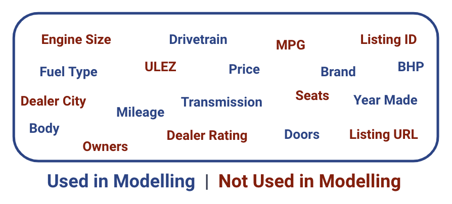

<p align="center">
   
</p>

# Understanding Value in the UK Used Car Market in 2022

# Context

This project was completed as part of the General Assembly Data Science Immersive bootcamp. This document discusses the problem, hypothesis, methodology, conclusion, and tools used.

# Table of Contents

# Background and Problem Statement

The second-hand car market in the UK is currently thriving due to the shortage of new models and cars under three years of age. According to [some figures](https://www.bbc.com/news/business-58150025) the used car market has grown astronomically since the pandemic began, with more than 2.2 million used cars exchanged since 2019.  

A global shortage of computer chips used in car production, as well as other materials such as copper, aluminium and cobalt, has led to fewer new vehicles rolling off production lines. That has meant more buyers turning to the used-car market. Of course the car industry has not been the only industry to suffer from the global chip shortage, but despite popular demand, the car industry has struggled to deliver brand new cars to buyers. Computer chips are used in everything from modern infotainment systems, windscreen wipers and electric car batteries to name a few.

It’s estimated the chip crisis will cause 100,000 vehicles to not be delivered before the end of 2021, representing a huge blow for the industry. 

<b>Given that the chip shortage is unlikely to be resolved in the immediate future, now more than ever it would be helpful to be able to identify good value in the UK used car market. That is what this project intends to do.</b>

# Objectives

My primary objective for this project is to:

* Generate a predictive model for used car price in the UK in 2022.
* The final model must be interpretable.

My secondary objective is to test the hypothesis that:

* When all other car attributes are equal, A Dacia branded car is cheaper than a Volvo branded car.

# Data Acquisition

The data for this project came from [autotrader.co.uk](https://www.autotrader.co.uk/). Although AutoTrader do have an API, access is only permitted with a commercial contract. As such, the project data had to be obtained through use of a web scraper. Figure 1 below describes a typical search result on autotrader.co.uk

<br>
<p align="center" width="100%">
<kbd></kbd>
</p>
<p align="center"><i><sub><b>Figure 1:</b> Sample autotrader.co.uk search result page with scraped fields highlighted in green.</sub></i></p>
<br>

Evidently, each car listing is rich in information. At this early stage in the project a 'more is more' approach was adopted. It was intended to gather all information in as few web scrapes as possible, without duplicating work by going back to revisit a car listing at a later date. Of particular interest was the free-form text box between car year and car price - often where car listings were lacking in specific details such as BHP, engine size or number of doors, they could be found and recovered from this string using RegEx. 

Over 400,000 new and used cars were successfully scraped from AutoTrader. 

Two problems overcome during web scraping:
* Problem 1 involved a hard limit on the search results. Search results were limited to 1000 car listings per search. This is not a problem if the search criteria are highly specific as the platform would expect, although for this project it was important to return all car listings. To navigate this problem, thousands of complimentary searches were performed and the number of returned results were verified to be less than 1000 before continuing to scrape the data.
* The solution to problem 1 likely contributed to problem 2; the searching behaviour was being flagged as problematic by the website. AutoTrader employ Cloudflare website security to prevent algorithms like this overloading their server with requests. The security successfuly prevented the Python Requests package from gaining access to search results, however switching to Cloudscraper instead resolved all issues. 

After a small number of iterative improvements to the web scraping function, the dataset was scraped in four days in the week commencing 31/01/2022. This is the date at which data are accurate.

<br>
<p align="center" width="100%">
<kbd></kbd>
</p>
<p align="center"><i><sub><b>Figure 2:</b> Exhaustive list of the data points scraped for each car listing. Not all data points persisted into the final model, but that wasn't to be known at this stage.</sub></i></p>
<br>

# Data Cleaning and Feature Engineering

The AutoTrader dataset has been gathered from car listings which are posted by thousands of dealers across the UK. As such, the car listings can be a little variable in terms of content and quality. Full details on the data cleaning performed in this project are availble in the <b>LINKED JUPYTER NOTEBOOK</b>, with some of the more interesting parts summarised below:
* BHP data were standardised in terms of units. Some more recent cars were reported in units of PS - the German equivalent.
* Dealer location and rating data were extracted from the associated dealer href.
* Engine size was populated using RegEx - see figure 3 below. This was particularly problematic for electric vehicles as they don't have cylinders. in the engine and measure size in units of kilowatts instead of litres. An additional e_engine column was added to differentiate.
* Number of doors was populated and standardised using RegEx. Interestingly pickup trucks describe doors in a different way to all other cars.
* Added a used/new flag to allow for simple filtering.
* Utilised GeoPy with the Google Maps API to obtain dealer county information. This involved moving from dealer location, which was often a city or an area, to dealer latitude and longitude before reverting back to dealder county.

```python3
# Iterate over missing engine rows and use RegEx on name_subtitle to extract engine 
# size where possible. Note that electric engines are handled differently.

for index, car in ucars[ucars['engine'].isnull()].iterrows():
    car_subname = ucars.loc[index, 'name_subtitle']
    try:
        enginesize = re.findall('([0-9][.][0-9]+)',car_subname)[0]
    except: 
        enginesize = np.nan
    ucars.loc[index,'engine'] = float(enginesize)
```
</p>
<p align="center"><i><sub><b>Figure 3:</b> Sample data cleaning codeblock using RegEx to extract missing engine size data.</sub></i></p>
<br>

With all data cleaning and feature engineering finished, there were 400,247 new and used cars in the dataset. 378,597 of these were used cars, which this project focuses on. A [data dictionary file](data_dictionary.md) has been prepared to provide further detail. 

# Exploratory Data Analysis (EDA)

Although this is a used car project, data have been scraped and cleaned for both new and used cars. It was at this point, the beginning of the EDA that new cars were dropped to focus on used cars only. 

There were no immediate surprises in the EDA. The dataset was scruitinised from a number of different angles to check for patterns and trends. Some of the more descriptive relatonships within the dataset are captured in figures 4-7 below, with a more comprehensive EDA to be found in the <b>LINKED JUPYTER NOTEBOOK</b>.

<br>
<p align="center" width="100%">
<kbd></kbd>
</p>
<p align="center"><i><sub><b>Figure 4:</b> Plot describes the quantity of used cars for sale in the UK for the 30 most common brands.</sub></i></p>
<br>

Evidently a BMW is the most common used car for sale in the UK right now making up just under 10% of all used cars on AutoTrader. German brands do well in general, with four of the top five most common brands from Germany. 

<br>
<p align="center" width="100%">
<kbd></kbd>
</p>
<p align="center"><i><sub><b>Figure 5:</b> Plot describes price distribution by car brand for each of the 16 most common car brands.</sub></i></p>
<br>

Figure 5 tells many stories about the price distribution of the different car brands displayed. Land Rover, Mercedes-Benz and Volvo stand out as some of the most expensive used cars brands, with Vauxhall and Renault the least expensive. beyond this the skew of each brand distribution tells of how varied their car offering is. The high skew brands such as Land Rover, Audi, BMW and Mercedes-Benz have a greater number of cars for sale beyond the 95th percentile and it can be deduced that these brands cater to the high-end car market as well as to their prime market between the 1st and 3rd interquartile ranges. The same cannot be said for brands like Mini, where the skew is much reduced.

<br>
<p align="center" width="100%">
<kbd></kbd>
</p>
<p align="center"><i><sub><b>Figure 6:</b> Plot describes the average used car price by year produced. Black confidence bounds at the top of each bar can be seen to grow wider as cars grow older due to a reduced number of cars for sale from each year. The same effect can be seen for used cars from 2022.</sub></i></p>
<br>

The average used car value plot by year produced points out an interesting non-linear relationship between used car price and age. Average used car price seems to fall from 2022 produced cars to 2003 produced cars at which point it begins to rise slightly. This may be due to the influence of some sort of unexplained vintage-factor. The fact that this relationship is not perfeclty linear may have implications for linear models, to be broached in the modelling section. 

<br>
<p align="center" width="100%">
<kbd></kbd>&nbsp; &nbsp; &nbsp; &nbsp;<kbd></kbd>
</p>
<p align="center"><i><sub><b>Figure 7:</b> Plot describes price distribution by car transmission on the left and by car drivetrain on the right.</sub></i></p>
<br>

Figure 7 is the final plot in this EDA section and images the used car price distribution when divided by two of the categorical variables; drivetrain and transmission. Early indications show that categorical variables such as these should be valuable in determinining used car value. Manual trasmission cars are generally cheaper than automatic transmission cars and four-wheel-drive cars are generally more expensive than front-wheel-drive cars. Interestingly rear-wheel-drive cars seem to be more expensive than front-wheel-drive cars. This may becasue rear-wheel-drive cars in the UK are predominantly BMW or Mercedes-Benz, which have been identified as more expensive in figure 5. 

# Modelling

## Selecting a Model

A range of nine predictive models were evaluated on a random subset of 50,000 used cars in order to provide a quick evaluation of model suitability. An overview of the tested models can be found on slide 6 of the non-technical presentation or specific details can be found in section <b>X OF THE LINKED JUPYTER NOTEBOOK</b>. For this summary, the range of R<sup>2</sup> scores and corresponding price residual distributions are presented for each of the tested models in figure 8 below. 

<br>
<p align="center" width="100%">
<kbd></kbd>
</p>
<p align="center"><i><sub><b>Figure 8:</b> Summary plot of tested models. Models are sorted from in ascending order by R<sup>2</sup> score on an unseen testing dataset. Machine learning methods tested came from the Scikit-Learn and XGBoost packages. </sub></i></p>
<br>

The top four models in figure 8 are based around linear regression and yield the least impressive scores. This is likely due to some violations of the linear regression assumptions. The final five models are based in decision trees, with the final four models employing either bagging or boosting to enhance predictions. Improvements in R<sup>2</sup> score from top to bottom are reflected in the shape of residual distribution for each method - a high R<sup>2</sup> score yields a taller, narrower residual distribution.

Although the XGBoostRegressor() marginally outperformed the GradientBoostingRegressor() on the test dataset, the GradientBoostingRegressor() model was evidenced to contain less variance and so was selected as the optimal model to proceed with. 

## The Final Model

# Evaluation

# Findings

# Limitations

# Conclusions

# Further Work

# Key Learnings and Challenges

# Libraries Used

# Contact
